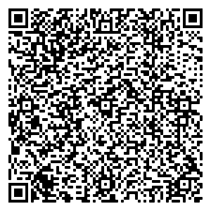

# Generate QR codes for Eyepto wallet

Generate your QR codes using the following JSON templates:

## Simple transaction

A simple ETH transaction with a target address:

```
{
  "n": "1",
  "t": "v",
  "a": "123456",
  "ta": "0x1230000000000000000000000000000000000123"
}
```

### Explanation

What every param means.

* **"n"** is the network ID, **1** for mainnet, 137 for polygon etc.
* **"t"** is the type, **v** for value transfer
* **"a"** is the amount, in this example **123456** wei
* **"ta"** is the target address, the address we are sending the network's native token to

### Result QR code


## Smart contract call

A call to a smart contract using the called function ABI's and data to be sent:

```
{
  "n": "1",
  "t": "f",
  "a": "123321",
  "ta": "0x1112223330000000000000000000000000000000",
  "d": {
    "a": {
      "constant": false,
      "inputs": [
        {
          "name": "inputOne",
          "type": "address"
        },
        {
          "name": "otherInput",
          "type": "uint256"
        }
      ],
      "name": "methodName",
      "outputs": [
        {
          "name": "",
          "type": "uint256"
        }
      ],
      "payable": true,
      "stateMutability": "payable",
      "type": "function"
    },
    "i": {
      "inputOne": "0x1230000000000000000000000000000000000321",
      "otherInput": "123"
    }
  }
}
```

### Explanation

What every param means.

* **"n"** is the network ID, **1** for mainnet, 137 for polygon etc.
* **"t"** is the type, **f** for function call
* **"a"** is the amount, in this example **123321** wei
* **"ta"** is the target address, the smart contract to call
* **"d"** is the data to be used for the smart contract call, contains **"a"** and **"i"**
* **"a"** is the abi of the method to call, you only need to specify the method to call
* **"i"** is the input of the method to call, it has to match the inputs list in the ABI of the function

### Result QR code



---

This document is a WIP. Other types of transactions like legacy ones (pre-compiled ones with web3) and bundled transfers are yet to be added.